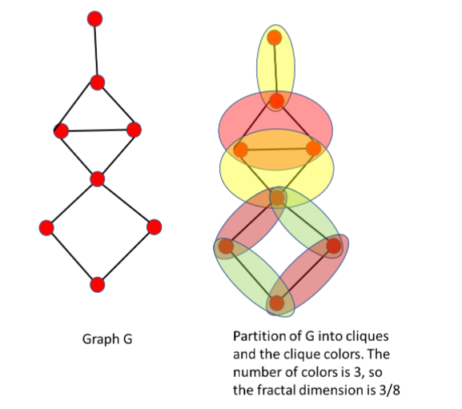

# Approximation_Algo_project
Submission for approximaiton algorithms project
  
## Problem Description:
### Input: A graph G
##### Find: a fractal dimension of G. It is defined by an optimal partition of a graph into cliques in such a way that every edge is covered by some clique from the partition. For a given partition, we color the cliques in such a way that intersecting cliques have different colors; the number of colors is the chromatic number of the partition. The goal is to find a partition with the minimal chromatic number; this number divided by the number of vertices is a fractal dimension of a graph.

